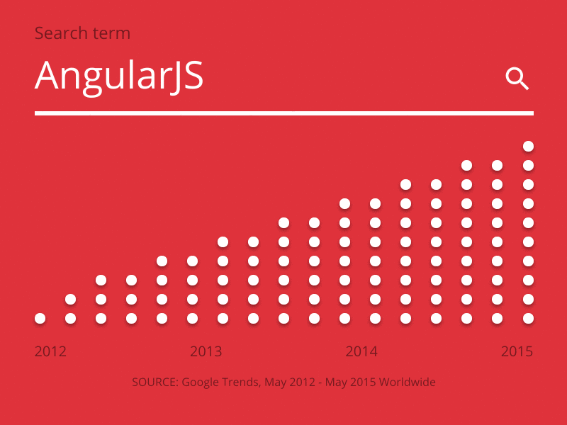

build-lists: true


---

## But First...

```
<RANT>

  <!-- Let's talk about MVC, MV, MVVm, MV*, WTF -->

</RANT>
```

---


---


---

## What is AngularJS?

AngularJS is a JavaScript framework that lets you build well structured, easily testable, and maintainable front-end applications.

---

## History & Future

- Originally created in 2010 by Misko Hevery and Adam Abrons, now run by the Google team.
- Google’s Vision for what a browser would be like if if was built from the ground up.
- Everything should be a component - see Angular v2.0

---

## Two Parts to Angular

1. UI - Declarative - What happens in the HTML.
2. App - Imperative - What happens in the JavaScript.

---

## Wait... wat?

What do you mean, "what happens in the HTML"? Isn't this a JavaScript framework?

---

## Why use AngularJS?

* Helps with organization of JavaScript
* Works well with other libraries (but requires none of them)
* Ability to create extremely fast websites
* It is easy to write tests for - _cause of modules_

---

## Also Community



---

## MVC

Um... so is AngularJS an MVC?

---

## Model

The model is made up of plain JS objects. No need for inheriting or extending. We also don't need to use any special getter/setter methods to access it. This means that we write less boilerplate code.

---

## ViewModel

It is an object that provides specific data and methods to maintain a specific view. `$scope` is just a regular JS object with a small API created to detect broadcast changes to its state.

---

## Controller

The controller is used for setting initial state and mutating the `$scope` with methods.

---

## View

The view is the HTML that exists after AngularJS has parsed and compiled the HTML to included rendered markup and bindings.

---

## Module

> A method that instantiates and wires together the different parts of the application.

```js
angular.module('whatever', []);
```

---

## `$scope`

- The `$scope` is a reference to the data. The controller defines the behavior and the view handles the layout and hands off interaction to the controller to respond accordingly. 
- Think of this as our "Imperative" part

--- 

## Directives

- A directive is a marker on a HTML tag that tells AngularJS to run or reference some JS code.
- Think of this as our "Declaritive" part

- `ng-repeat`
- `ng-click`
- `ng-show`
- `ng-class`

---

## TWO-WAY DATA BINDING

> AKA, The Magic of AngularJS


---
<br><br><br><br><br><br><br><br><br><br><br><br>
### [fit] ... yeah, but is two-way data binding good?

---

## Demos
