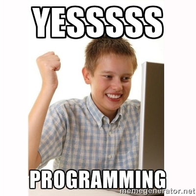
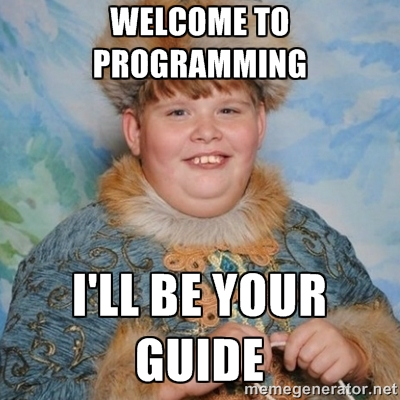

footer: The Iron Yard | 2016
slidenumbers: true

# JavaScript

## Crash Course

### Wifi

- Network: Student
- User: apollosrc\uop-ga-dunwoody
- Pass: internet




---

## What is JavaScript?

---

## What is JavaScript?

#### Well, it's not Java!

---

## So what is JavaScript?

JavaScript is an object-oriented computer programming language commonly used to create interactive effects within web browsers.

---

## So, What is Programming?

---

## So, What is Programming?

Writing instructions for your computer to execute at a later time.

---

## The Modern Web

* The Content Layer (HTML)
* The Design Layer (CSS)
* The Interactive Layer (JavaScript)

---

## What Is JavaScript Used For?

- Adding Fancy Page Interactions - [here](http://finegoodsmarket.com/view)
- Full Featured Web Apps - [here](https://foursquare.com/explore?mode=url&near=Sandy%20Springs%2C%20GA&nearGeoId=72057594042149269&q=sushi)
- Drawing & Animations - [here](http://animateddata.co.uk/lab/d3-tree/)
- Interactive elements - [here](http://codepen.io/twhitacre/full/MwKXxz/)
- Build a full backend - [here](http://nodejs.org/)

---

## Road Map

* Syntax
* Data Types
* Variables
* Chrome Console
* Expressions



---

## Syntax

```javascript
document.getElementById('header');
```

---

## Data Types

Other than `objects`, we have the following primitives:

* __**Number**__ - `1` or `500` or `3.14`
* __**String**__ - `"Any Message in Quotes"`
* __**Boolean**__ - `true` or `false`
* __**Null**__ - is an empty value: `null`
* __**Undefined**__ - is the absence of a value: `undefined`

---

##  Variables

Declare a variable

```javascript
var firstName;
```

Assign a value to a variable

```javascript
firstName = 'Tim';
```

Shorthand (Declare and assign)

```javascript
var firstName = 'Tim';
```

---

## Variables (Rules)

- Begin with letters, $ or _
- Only contain letters, numbers, $ and _
- Case sensitive
- No reserved words - [here](https://developer.mozilla.org/en-US/docs/Web/JavaScript/Reference/Lexical_grammar#Keywords)

---

## Variables (Conventions)

- camelCase vs snake_case
- Choose and stick with a convention

---

##[Chrome Console](http://timw.co/playground/)

---

## Expressions


> Variables can store the result of an expression

```javascript
var age = 2016 - 1983;
var greeting = "My name is Tim and I am " + age + " years old";
var isOld = age > 100;
```

---

## Comments

```javascript
var firstName = "Tim"; // Single Line Comment

/*
  Multi Line
  Comment (Comment Block)
*/
var a = 1;
var b = 2;
var c = 1 + 2;
```

---

## Functions

```javascript
function greet (name) {

  return “Hello, “ + name + “!”;

}

greet(“Tim”); // Hello, Tim!
```
---

# Let's Build Something

###[Catulator](http://codepen.io/twhitacre/pen/qZRxxx/right/?editors=1010)

---

## Quiz

> There are five (5) primitive data types in JavaScript. <br /><br /><br />

> What are they?

---

## Answers

* `Number`
* `String`
* `Boolean`
* `Null`
* `Undefined`

---

## Thank You

### Tim Whitacre | @timwco
