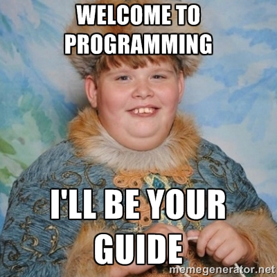

> "Learn you a JavaScript, <br /> for great good"

---


---

## What is JavaScript?

#### Well, it's not Java!

---

## So what is JavaScript?

JavaScript is an object-oriented computer programming language commonly used to create interactive effects within web browsers.

---

## So, What is Programming?

---

## So, What is Programming?

Writing instructions for your computer to execute at a later time.

---

## The Modern Web

* The Content Layer (HTML)
* The Design Layer (CSS)
* The Interactive Layer (JavaScript)

---

## What Is JavaScript Used For?

- Adding Fancy Page Interactions - [here](http://finegoodsmarket.com/view)
- Full Featured Web Apps - [here](https://play.spotify.com/browse)
- Drawing & Animations - [here](http://animateddata.co.uk/lab/d3-tree/)
- Interactive elements - [here](http://codepen.io/twhitacre/full/MwKXxz/)
- Build a full backend - [here](http://nodejs.org/)

---

## Road Map

* Syntax
* Data Types
* Variables
* Chrome Console
* Expressions



---

## Syntax

```javascript
document.getElementById('header');
```

---

## Data Types

* `Number` looks like: *1* or *500* or *3.14*
* `String` looks like "Any Message in Quotes"
* `Boolean` looks like *true* or *false*
* `Null` is an empty value: *null*
* `Undefined` is the absence of a value: *undefined*

---


##  Variables

Declare a variable

```javascript
var firstName;
```

Assign a value to a variable

```javascript
firstName = 'Tim';
```

Shorthand (Declare and assign)

```javascript
var firstName = 'Tim';
```

---

## Variables (Rules)

- Begin with letters, $ or _
- Only contain letters, numbers, $ and _
- Case sensitive
- No reserved words - [here](https://developer.mozilla.org/en-US/docs/Web/JavaScript/Reference/Lexical_grammar#Keywords)

---

## Variables (Conventions)

- camelCase vs snake_case
- Choose and stick with a convention

---

## Expressions


> Variables can store the result of an expression

```javascript
var age = 2016 - 1983;
var greeting = "My name is Tim and I am " + age + " years old";
var isOld = age > 100;
```

---

## Comments

```javascript
var firstName = "Tim"; // Single Line Comment

/*
  Multi Line
  Comment (Comment Block)
*/
var a = 1;
var b = 2;
var c = 1 + 2;
```

^ End Here Today

---

# Functions

```js
// Make Up of a Function
var name = function (param, param, param ...) {
    statements
};
```

```js
// Declare a Function
var sayHi = function () {
  console.log('hi');
};

// Call a Function
sayHi();
```

---

# Function Arguments

```js
var sayHiGreeting = function (name) {
  console.log("Hi, " + name);
};

sayHiGreeting("Tim");

var name = "Tim";
var otherGreeting = function (name, x, y, z) {
  console.log("Hi, " + name + " " + x + " " + y + " " + z);
};

otherGreeting(name, "how", "are", "you?");
```

---

## DOM

The `DOM` is the Document Object Model and it is a way for us to interact with our HTML page.


