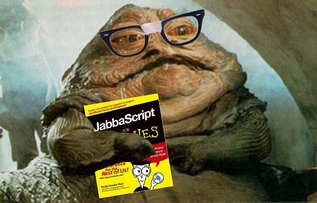

> "Learn you a JavaScript, <br /> for great good"

---



---

## What Is It Used For?

- Adding Fancy Page Interactions - [here](http://dev.sencha.com/playpen/ext-core-latest/examples/lightbox/)
- Full Featured Web Apps - [here](http://www.rdio.com/new/)
- Drawing & Animations - [here](http://raphaeljs.com/analytics.html)
- Interactive elements - [here](http://codepen.io/twhitacre/full/MwKXxz/)
- Build a full backend - [here](http://nodejs.org/)

---

# Syntax

```js
document.getElementById('header');
```

- `document`: object
- `.`: property accessor
- `getElementById`: property (in this case, a function)
- `()`: function call
- `'header'`: parameter (in this case, a String)
- `;`: end of the statement


---

# Statements

```js
var name = “Tim”;
```

```js
console.log('Hi, my name is ' + name);
```

---

# Variables

Declare a variable

```js
var name;
```

Assign a value to a variable (initialize)

```js
name = 'Tim';
```

Shorthand (Declare and assign)

```js
var name = 'Tim';
```


---

# Primitives

- String (immutable chunk of characters)

```js
var hello = "Good morning, Tim";
```

- Number (5, -20 or floats like 1.225)

```js
var age = 31;
var pi = 3.14;
var temp = -7;
```

- Boolean (true or false)

```js
var freezingIsFun = true;
var heightsAreAwesome = false;
var is_old = 31 > 30;
```

---

# Primitives

- Undefined (not yet defined)

```js
var nothing;
```

- Null (empty value)

```js
var nothing = null;
```

---

# Variables

- Begin with letters, $ or _
- Only contain letters, numbers, $ and _
- Case sensitive
- No reserved words - [here](https://developer.mozilla.org/en-US/docs/Web/JavaScript/Reference/Lexical_grammar#Keywords)
- camelCase vs using _'s
- Choose a convention

---

# Expressions

> Variables can store the result of an expression

```js
var age = 2014 - 1983;
var greeting = "My name is Tim and I am " + age + " years old";
```

---

# Loose Typing

```js
// You can change me!
var x;
x = 31;
x = "Tim"
```

```js
// What happens here?
var x = 2 + "Tim";
```

---

# Comments

```js
var name = "Tim"; // Single Line Comment

/*
  Multi Line
  Comment
*/
var a = 1;
var b = 2;
var c = 1 + 2;
```

^ End Here Today

---

# Functions

```js
// Make Up of a Function
var name = function (param, param, param ...) {
    statements
};
```

```js
// Declare a Function
var sayHi = function () {
  console.log('hi');
};

// Call a Function
sayHi();
```

---

# Function Arguments

```js
var sayHiGreeting = function (name) {
  console.log("Hi, " + name);
};

sayHiGreeting("Tim");

var name = "Tim";
var otherGreeting = function (name, x, y, z) {
  console.log("Hi, " + name + " " + x + " " + y + " " + z);
};

otherGreeting(name, "how", "are", "you?");
```

---

## DOM

The `DOM` is the Document Object Model and it is a way for us to interact with our HTML page.


