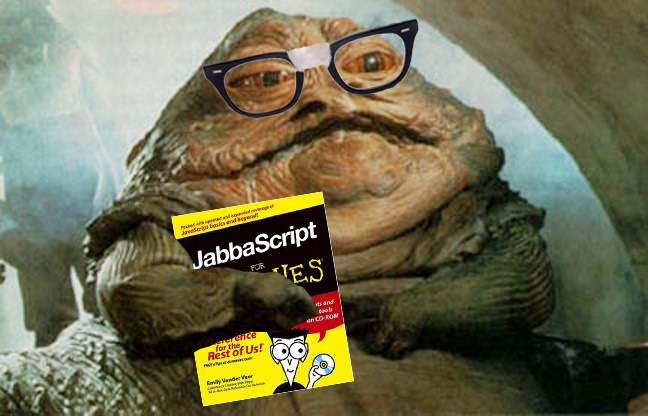

---

## What Is It Used For?

- Adding Fancy Page Interactions - [here](http://dev.sencha.com/playpen/ext-core-latest/examples/lightbox/)
- Full Featured Web Apps - [here](http://www.rdio.com/new/)
- Drawing & Animations - [here](http://raphaeljs.com/analytics.html)
- Interactive elements - [here](http://codepen.io/twhitacre/full/MwKXxz/)
- Build a full backend - [here](http://nodejs.org/)

---

## [fit] Data Type Reviews

---

```javascript
var something = 'Tim';
```

---

```javascript
var something = '5';
```

---

```javascript
var something = 55;
```

---

```javascript
var something = 4 > 3;
```

---

```javascript
var something = 2.9948377111199;
```

---

```javascript
var something = false;
```

---

```javascript
var something;
```

---


```javascript
var something = null;
```

---

# Variable "Rules"

- Begin with letters, $ or _
- Only contain letters, numbers, $ and _
- Case sensitive
- No reserved words - [here](https://developer.mozilla.org/en-US/docs/Web/JavaScript/Reference/Lexical_grammar#Keywords)
- camelCase vs snake_case
- Choose a convention

---

# Comments

```js
var name = "Tim"; // Single Line Comment

/*
  Multi Line
  Comment
*/
var a = 1;
var b = 2;
var c = 1 + 2;
```

^ End Here For Now

---


# Functions

```js
// Make Up of a Function
var name = function (param, param, param ...) {
    statements
};
```

```js
// Declare a Function
var sayHi = function () {
  console.log('hi');
};

// Call a Function
sayHi();
```

---

# Function Arguments

```js
var sayHiGreeting = function (name) {
  console.log("Hi, " + name);
};

sayHiGreeting("Tim");

var name = "Tim";
var otherGreeting = function (name, x, y, z) {
  console.log("Hi, " + name + " " + x + " " + y + " " + z);
};

otherGreeting(name, "how", "are", "you?");
```

---

## DOM

The `DOM` is the Document Object Model and it is a way for us to interact with our HTML page.