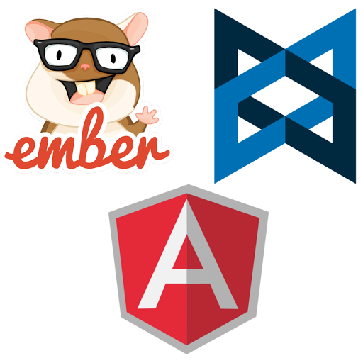

# MVC*

---

## Single Page Applications

* Gmail
* Google Docs
* Unmark

---

## Currently...

DOM Manipulation (jQuery) 

Functional Language (Underscore)

Nested callbacks, poor data binding, basically spaghetti code

---

## JavaScript Frameworks & Libraries

> MVC... or is it MV, or MVVM, or MV* ... I'm confused

---

---

> Let's first look at what a standard MVC looks like

---

## MODELS

> They represent the data in your application. This can be viewed as a type of data you can model, like a Person, User, Car, ToDo etc. Models should always be up to date and be able to notify anyone about their current state.

---

## Views

> They are what the user of your application interfaces with. Views are always aware of your Models but don't directly communicate with them.

---

## Controllers

> They handle the actions. They take input, watch for clicks and other user actions. Basically Controllers handle the input while Views handle the output. A controller will update your Modal and then because of the relationship with the view it will be updated there. Note though that your controller does not talk to your view.

---

Some frameworks... like Backbone... don't really have Controllers, but pass off the responsibility of what a Controller normally does to the View. 

In this case we call this a MV* pattern. You still have a View & and a Model.
