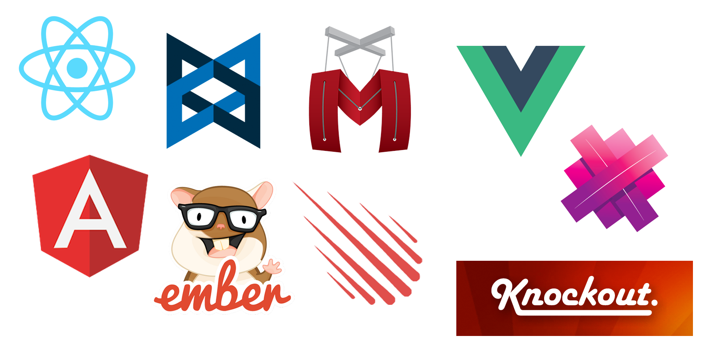

# MVC*

---

## (M)odel   

## (V)iew   

## (C)ontroller

---

## Single Page Applications

* Gmail
* Google Docs
* Trello

---

## Currently...

DOM Manipulation (jQuery) 

JavaScript Template (ES6 Template Literals)

Nested callbacks, poor or no data binding

---

> Honestly, we are starting to approach spaghetti code

---

## JavaScript Frameworks & Libraries

> MVC... or is it MV, or MVVM, or MV* ... I'm confused

---

---

> Let's first look at what a the pieces of MVC are

---

## MODELS

> They represent the data in your application. This can be viewed as a type of data you can model, like a Person, User, Car, ToDo etc. Models should always be up to date and be able to notify anyone about their current state.

---

## Views

> They are what the user of your application interfaces with. Views are always aware of your Models but don't directly communicate with them.

---

## Controllers

> They handle the actions. They take input, watch for clicks and other user actions. Basically Controllers handle the input while Views handle the output. A controller will update your Modal and then in return your view will be updated. Basically, for the most part you can think of the controller as sitting between

---

Let's take a deeper look
