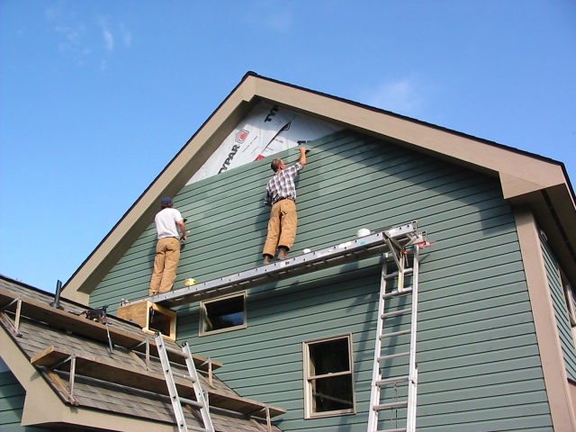

# Problem Solving
## (The Story of Tim)

---

---

---

## Remember You Are Solving Real Problems
#### Code & syntax are only half the battle.

---

---

## Seek Outside Help
#### Consider bringing on outside help

---

---

## Seek Inside Help
#### You are a LOT smarter than you realize

---

---

---

## Take Time
#### Take time to reevaluate your approach

---

---

### Guide to Problem Solving

* Remember You Are Solving Real Problems
* Seek Outside Help
* Seek Inside Help 
* Take Time 
